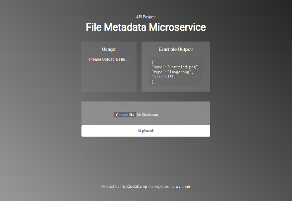

# [File Metadata Microservice](https://www.freecodecamp.org/learn/apis-and-microservices/apis-and-microservices-projects/file-metadata-microservice)

- ### [freeCodeCamp](https://www.freecodecamp.org/) project page:
  
  https://www.freecodecamp.org/learn/back-end-development-and-apis/back-end-development-and-apis-projects/file-metadata-microservice

- ### npm packaged used:
  [Multer](https://www.npmjs.com/package/multer)

## Solution:

https://boilerplate-project-filemetadata.wy-chan.repl.co

|  |
| ------- |

## Usage:

- Example Usage:

   - Upload a file: Untitled.png
     

- Example Output:

      {
        "name":"Untitled.png",
        "type":"image/png",
        "size":451
      }

## Tasks:
 - [x] You can submit a form that includes a file upload.

 - [x] The form file input field has the name attribute set to upfile.

 - [x] When you submit a file, you receive the file name, type, and size in bytes within the JSON response.

